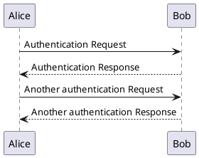

## Agenda

1. HTTP
2. REST 

## HTTP

### Protocol

- connectionless
- media independent
- stateless

### State



### Uniform Resource Identifier

```
URI = "http:" "//" host [ ":" port ] [ abs_path [ "?" query ]]
```

### Media types

### Messages

### Headers

- General-header
- Request-header
- Response-header
- Entity-header

### Message body

```
<html>
    <head>
    </head>
    <body>
        <h1>Hello, World!</h1>
    </body>
</html>
```

### Request methods

- GET
- HEAD
- POST
- PUT
- DELTETE
- CONNECT
- OPTIONS
- TRACE

### Request Header Fields

### Response methods

- A Status-line
- Zero or more header (General|Response|Entity) fields followed by CRLF
- An empty line (i.e., a line with nothing preceding the CRLF) indicating the end of the header fields
- Optionally a message-body

### Message status line

### HTTP version

### Status Code

## REST

### What is

### Methods

## Examples

### Stash

### JIRA

### ELVIS