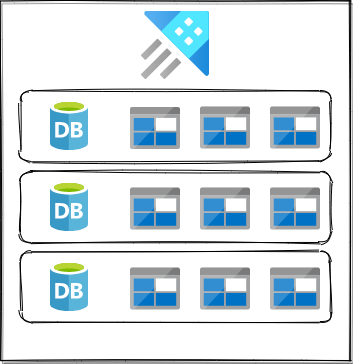
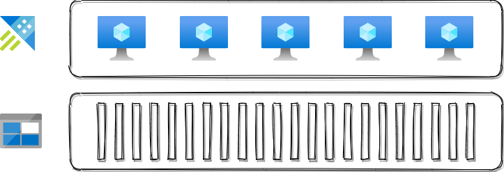
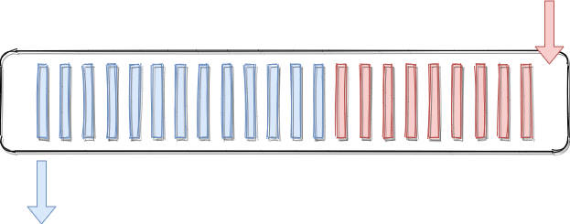
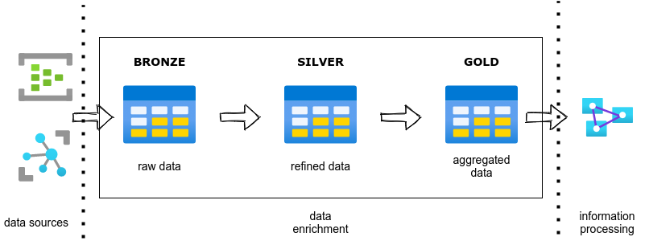
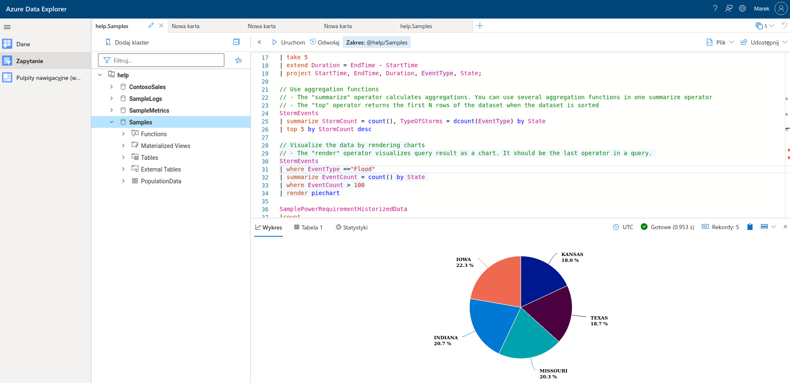

## Set and setting


- presentation: 45 min
- Q&A: ~15 min
- Ask your questions on a chat, I'll try to answer ASAP
- Q&A time at the very end
- Have fun :-)

---
<!-- _class: title -->
## Applied Azure Data Explorer


##### Marek Gawryszewski

##### _2022.02.15_

---

## Roadmap

- Azure Data Explorer - what it is?
- Kusto Query Language - hands-on intro
- Why, when, how?

---

## What is ADX?

> A big data analytics cloud platform optimized for interactive, ad hoc-queries


---

## What is ADX?

- PaaS
- append only
- 3V: volume, velocity, variance
- data: structured, semi-structured, unstructured
- query with Kusto Query Language (KQL)

---

## ADX Architecture

Logical structure:

- cluster,
- database,
- table



[source](https://www.youtube.com/watch?v=HGcABe5qKs0)

---

**Physical structure**

- nodes,
- [extents](https://www.youtube.com/watch?v=72RhLMg4YuU)



<!--
extend = shard
immutable, część tabeli
przypisane do noda
-->

---

**Data lifecycle**

- hot cache,
- cold cache



---

### Ingress

[source](https://docs.microsoft.com/en-us/azure/data-explorer/ingest-data-overview)


---

### How to organize data?



---

## Too short intro to KQL

<!--
30 min remaining
-->

[KQL quick reference](https://docs.microsoft.com/en-us/azure/data-explorer/kusto/query/)

```sql
Perf
| where TimeGenerated > ago(1h) 
| summarize count() by ObjectName
```

```sql
Perf
```

```sql
| where TimeGenerated > ago(1h)
```

```sql
| summarize count() by ObjectName
```

---

### How to try for _free_?

- [Free ADX cluster](https://dataexplorer.azure.com/clusters/help)
- [Free cluster for Log Analytics](https://portal.azure.com/#blade/Microsoft_Azure_Monitoring_Logs/DemoLogsBlade)



---

## 80/20 rule for KQL

- `count` - return no. of records
- `take`- return no. of first records
- `where`- filter
- `summarize`- aggregates
- `extend`- create new(computed) column in the output
- `let`- define querable object
- `project-away` - delete column from the result
- `project` - include columns from the list

<!--

Perf
| where "CounterName"== "Free Megabytes"
| extend FreeGB = CounterValue / 1024
-->

---

## Query with SDK

### C# example

```csharp
var client = Kusto.Data.Net.Client.KustoClientFactory
        .CreateCslQueryProvider("https://help.kusto.windows.net/Samples;Fed=true");
var reader = client.ExecuteQuery("StormEvents | count");
```

[reference](https://docs.microsoft.com/en-us/azure/data-explorer/kusto/api/netfx/about-kusto-data)
[examples](https://github.com/Azure/azure-kusto-samples-dotnet/tree/master/client)

---

## Usage scenarios

1. Analysis of Azure Compute logs
2. Analysis of security threats
3. Data analysis on the spot
4. Data storage engine for IoT solution
<!--
- time series analysis
    - Azure Monitor
    - Sentinel
    - _IoT data_❤️
-->

---

## When (not) to choose ADX?

[reference](https://docs.microsoft.com/en-us/azure/data-explorer/data-explorer-overview)


---

## Azure Monitor

<!--
202 min remaining
-->

[Demo Workspace](https://aka.ms/lademo)

- Azure Monitor Logs uses ADX 

- extra: [Query data in Azure Monitor using Azure Data Explorer](https://docs.microsoft.com/en-us/azure/data-explorer/query-monitor-data)


<!-- https://www.youtube.com/watch?v=DuWBLsgqhaI -->

---

### Demo 1

```sql
SecurityEvent
| where TimeGenerated >= ago(30d)
| where EventID == 4625
| project TimeGenerated, Account, Computer, EventID, Activity, IpAddress
| summarize FailedLogons = count() by Computer
| order by FailedLogons
| render piechart
```

---

### Demo 2

```sql
Perf
| where ObjectName == "Process"
| where CounterName == "% Processor Time"
| where CounterValue > 0
| extend CPUTime = strcat(tostring(round(CounterValue, 1)), "%")
| project TimeGenerated, Computer, InstanceName, CounterValue, CPUTime
| summarize arg_max(TimeGenerated, *) by Computer
| order by CounterValue desc
```

---

### ADX for IoT

Reference architectures and solutions:

- [Big data analytics with Azure Data Explorer](https://docs.microsoft.com/en-us/azure/architecture/solution-ideas/articles/big-data-azure-data-explorer)
- [Azure IoT reference architecture](https://docs.microsoft.com/en-us/azure/architecture/reference-architectures/iot)
- [IoT analytics with Azure Data Explorer](https://docs.microsoft.com/en-us/azure/architecture/solution-ideas/articles/iot-azure-data-explorer)

---


<!--
- IoT produkuje ogromne ilości danych czasowych
- potrzebna jest usługa do przechowywania tego i analizy, łącznie z ML
-->

---

## Key Takeaways

- ADX is used by many services for telemetry storage
- KQL is helpful for any DevOps working with Azure
- ADX is not a replacement for MSSQL or CosmosDB
- ADX requires crafted solution architecture

---

# Q&A

<!--
00 min remaining
-->

---

## Links

### Documentation

- [Azure Data Explorer](https://azure.microsoft.com/pl-pl/services/data-explorer/)
- [Azure Data Explorer documentation](https://docs.microsoft.com/en-us/azure/data-explorer/)
- [IoT analytics with Azure Data Explorer](https://docs.microsoft.com/en-us/azure/architecture/solution-ideas/articles/iot-azure-data-explorer)

---

## Links

### Github

- [rod-trent](https://github.com/rod-trent)
- [MustLearnKQL](https://github.com/rod-trent/MustLearnKQL)
- [SentinelKQL](https://github.com/rod-trent/SentinelKQL)
- [AddictedtoKQL](https://github.com/rod-trent/AddictedtoKQL)


---

## Links

### YouTube

- [KQL Cafe | Session 1](https://www.youtube.com/watch?v=hD_j2XqXc_o)
- [Azure Data Explorer channel](https://www.youtube.com/channel/UCPgPN-0DLaImaaDR_TtKR8A)

---

## Links

- [Azure Cloud & AI Domain Blog](https://azurecloudai.blog/)
- [Stack Overflow tag](https://stackoverflow.com/questions/tagged/azure-data-explorer?tab=Votes)
- [Pluralsight: How to Start with Microsoft Azure Data Explorer](https://app.pluralsight.com/library/courses/microsoft-azure-data-explorer-starting)