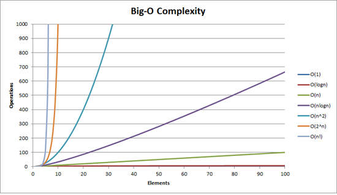
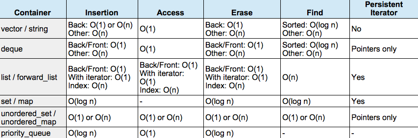

## Available containters

    * sequence: array, vector, forward_list, list, deque
    * sequence adapters: stack, queue, priority_queue
    * associative: set, map, multiset, multimap
    * unordered: unordered_set/map/multiset.multimap

source: [Medium](https://medium.com/@rodrigues.b.nelson/choosing-wisely-c-containers-and-big-oh-complexity-64f9bd1e7e4c)

## Recap

* _Associative container_: abstract data type composed of pairs (key,value), such that key appears only once in the collection

* _Sequence container_: abstract data type that represents countable number of values

source: 
source: )

## How to choose containers?
 
## Depending on task

{ height=500px }

## Depending on complexity

## What is O(n)?

{ height=500px }

##

{ height=500px }

 	source: [John Ahlgren: STL Container Performance](http://john-ahlgren.blogspot.com/2013/10/stl-container-performance.html)

## General Rules of Thumb

*Use sequential containers when you need to access elements by position*

* Use std:vector as your default sequential container, especially as an alternative to built-in arrays
* If size is known in advance, use std::array instead of a built-in array
* If you add or remove elements frequently at both the front and back of a container, use std::deque

## General Rules of Thumb

* Use a std::list (not std::deque) if you need to insert/remove elements in the middle of the sequence
* Do not use std::list if you need random access to objects
* Prefer std::vector over std::list if your system uses a cache
* std::string is almost always better than a C-string

## General Rules of Thumb

*Use associative containers when you need to access elements by key*

* For key/value pair, default to std::unordered_map, or if element order matters, std::map
* If you need multiple entries for the same key, use std::unordered_multimap, or if element order matters, std::multimap

## Links

* [Embedded Artistry An Overview of C++ STL Containers](https://embeddedartistry.com/blog/2017/8/2/an-overview-of-c-stl-containers)
* [SO In which scenario do I use a particular STL container?](https://stackoverflow.com/questions/471432/in-which-scenario-do-i-use-a-particular-stl-container)
* [Medium C++ STL Containers Selection Flowchart](https://medium.com/@ebrahim.bararian/c-stl-containers-selection-flowchart-d64230ccacfd)
* [C++ STL's When to use which STL](https://www.hackerearth.com/practice/notes/c-stls-when-to-use-which-stl/)
* [SO: What are Containers/Adapters? C++](https://stackoverflow.com/questions/3873802/what-are-containers-adapters-c)